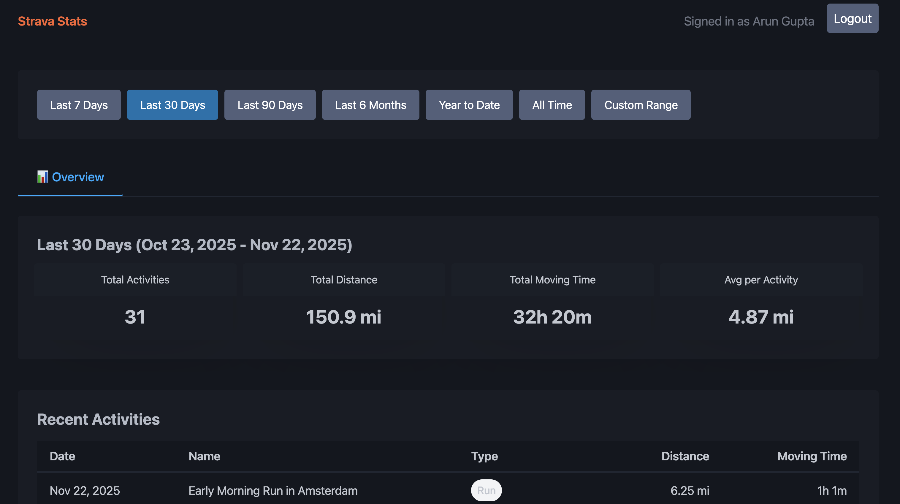

# Strava Activity Analyzer (DotNet)


An ASP.NET Core 8 Web API for analyzing Strava activities. This repo will later include a frontend dashboard, but Phase 1 focuses on backend auth and data ingestion.

## Quickstart

One-minute setup on macOS with Homebrew (recommended). For other platforms and details, see Advanced Setup below.

1) Install .NET 8 SDK (LTS)
```bash
brew update
brew install --cask dotnet-sdk@8
```

2) Configure secrets for local dev
```bash
cp .env.example .env
# edit .env and set
# STRAVA_CLIENT_ID=...
# STRAVA_CLIENT_SECRET=...
# SESSION_SECRET=...
```

3) Start the API (opens Strava auth by default)
```bash
./start.sh        # first time you may need: chmod +x start.sh
```

After signing in with Strava, you’ll be redirected to your dashboard:



### About the start.sh helper
On macOS/Linux (or Git Bash on Windows), `start.sh` will:
- Load variables from `.env` if present.
- Default `ASPNETCORE_ENVIRONMENT=Development` if not set.
- Run `dotnet restore`, `dotnet build`, and start the API.

Note: If you see a message about a missing framework like "Microsoft.NETCore.App 8.0.0", ensure the .NET 8 runtime is installed as shown above.

### Advanced setup and alternatives
- Windows/Linux install instructions, PATH notes, and using dotnet user-secrets are documented here:
  - docs/setup.md

## Secrets & configuration (Task 1.2)

Never commit secrets. This repo ignores `.env` and common secret files.

Supported configuration keys:
- `Strava:ClientId` / `Strava:ClientSecret` — Strava OAuth application credentials
- `Security:SessionSecret` — secret for session/cookie/HMAC usage

You can provide them using either nested keys or flat env vars:
- Nested (ASP.NET style): `Strava__ClientId`, `Strava__ClientSecret`, `Security__SessionSecret`
- Flat (legacy/simple): `STRAVA_CLIENT_ID`, `STRAVA_CLIENT_SECRET`, `SESSION_SECRET`

Both styles are supported. At startup we map the flat variables into the nested section so options binding works consistently.

### Option A: .env (local only)
Use the provided example file to set your Strava credentials locally. The app’s `start.sh` script auto-loads `.env` at startup.

1. Copy the example file and fill real values:
   ```bash
   cp .env.example .env
   # edit .env and set values
   # STRAVA_CLIENT_ID=... 
   # STRAVA_CLIENT_SECRET=...
   # SESSION_SECRET=...
   ```
2. Start the app (the script reads `.env` automatically):
   ```bash
   ./start.sh
   ```
   No extra exports or tools are required. If you prefer not to use `start.sh`, make sure your shell loads the variables from `.env` before running `dotnet run`.

### Option B: dotnet user-secrets (recommended for local dev)
User Secrets stores values outside the repo, per machine.

```bash
dotnet user-secrets init --project src/StravaStats.Api
dotnet user-secrets set "Strava:ClientId" "<your_client_id>" --project src/StravaStats.Api
dotnet user-secrets set "Strava:ClientSecret" "<your_client_secret>" --project src/StravaStats.Api
dotnet user-secrets set "Security:SessionSecret" "<a-long-random-string>" --project src/StravaStats.Api
```

### Option C: Environment variables (CI/container/prod)
Set either nested or flat variables in your deployment environment. Examples (Bash):

```bash
export Strava__ClientId=123
export Strava__ClientSecret=abc
export Security__SessionSecret=$(openssl rand -hex 32)
```
or
```bash
export STRAVA_CLIENT_ID=123
export STRAVA_CLIENT_SECRET=abc
export SESSION_SECRET=$(openssl rand -hex 32)
```

## Repo structure

```
src/
  StravaStats.Api/
    Options/
      StravaOptions.cs
      SecurityOptions.cs
    Program.cs
    appsettings.json
    Properties/launchSettings.json
docs/
start.sh
```

## Roadmap
See `docs/specs/tasks.md` and `docs/specs/plan.md`.


### Git hooks (auto add Co‑authored‑by: Junie)
This repository is configured to append a co‑author trailer to every commit message via a local Git hook.

Setup (one time per clone):
```bash
git config core.hooksPath .githooks
chmod +x .githooks/prepare-commit-msg
```

After this, your commits will automatically include:
```
Co-authored-by: Junie <junie@jetbrains.com>
```
The hook skips merge commits and won’t duplicate the trailer if it already exists.

