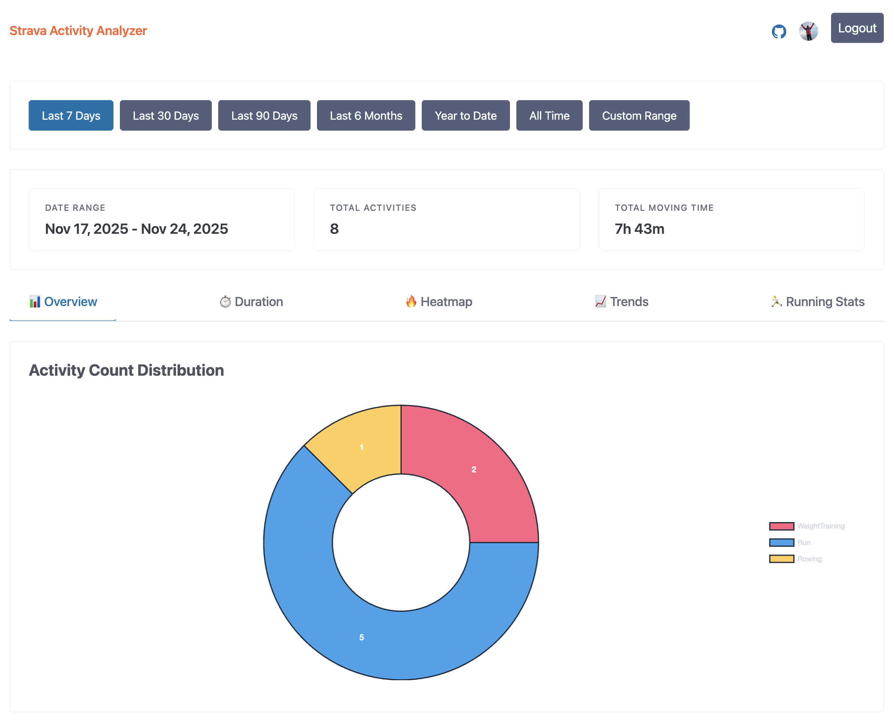
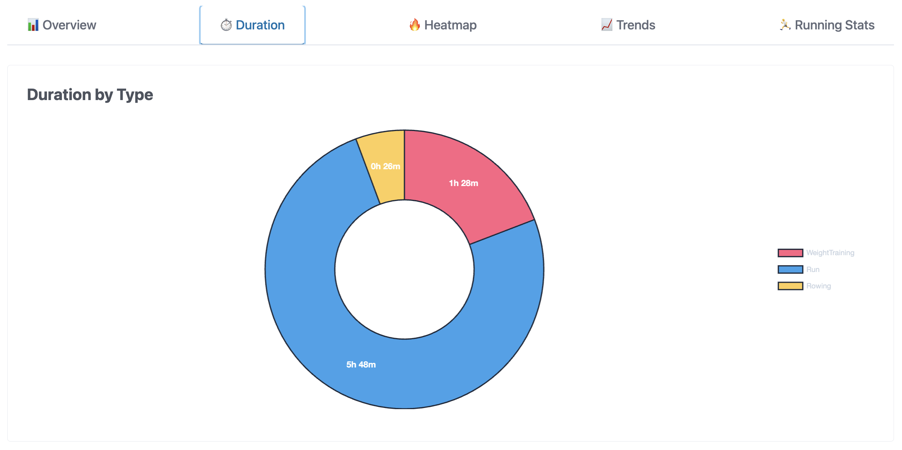
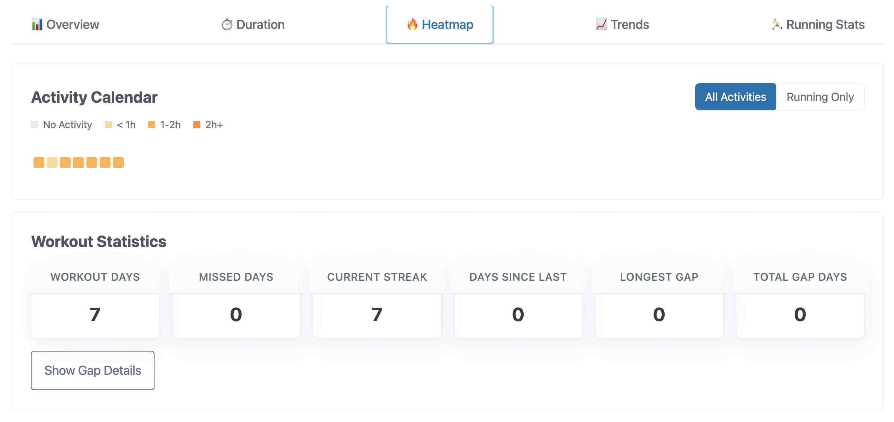
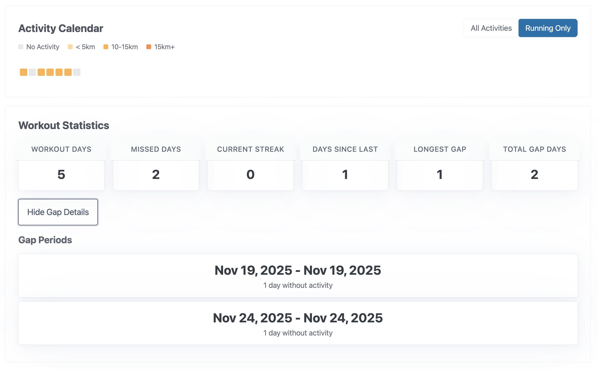
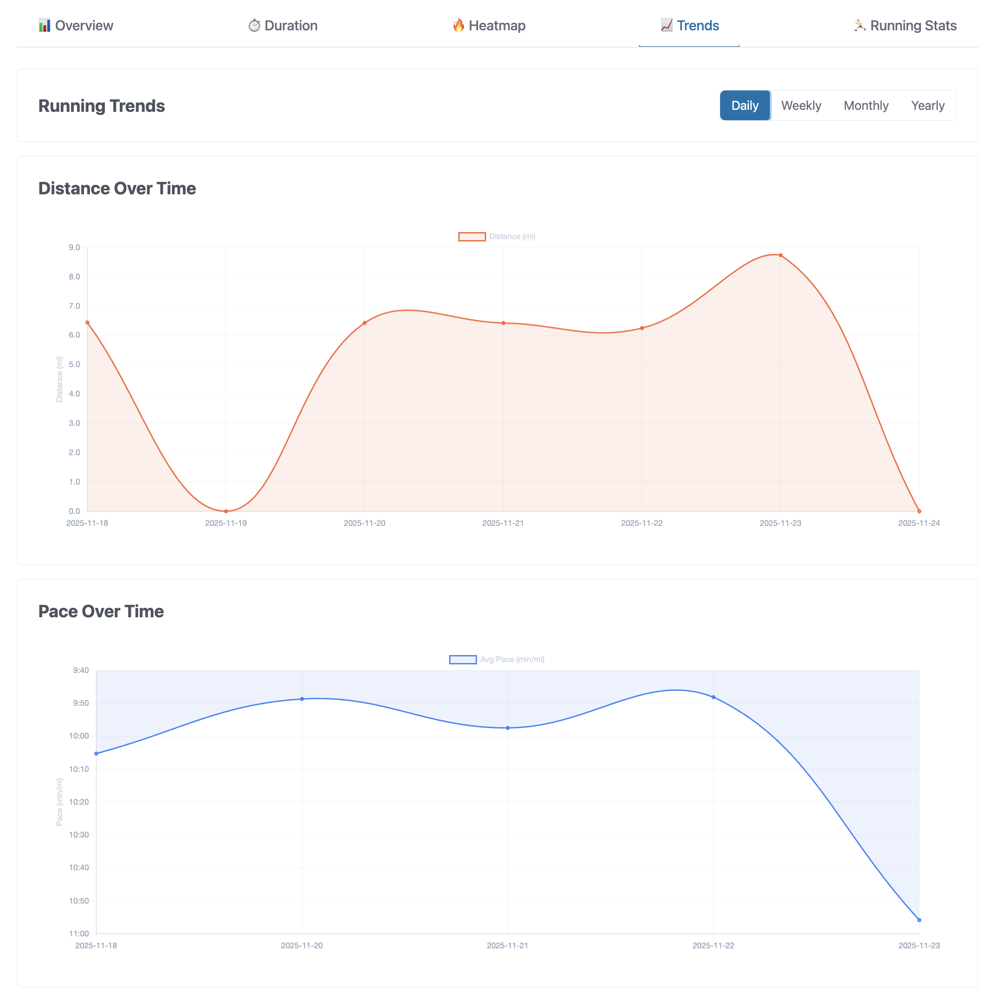
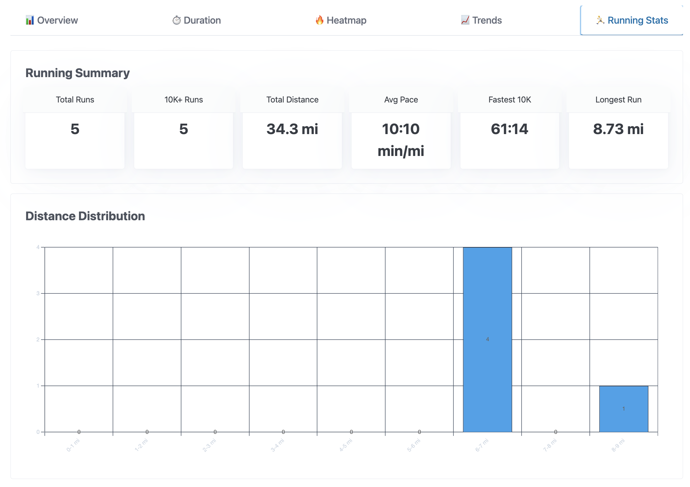

# Strava Activity Analyzer (DotNet)


An ASP.NET Core 8 Web API for analyzing Strava activities with an interactive dashboard for tracking your fitness progress.

## Features

Current highlights:
- **Secure Authentication**: OAuth login with Strava, secure server-side session (no tokens exposed to browser), automatic token refresh
- **Smart Data Fetching**: Typed Strava API client with pagination and respectful rate-limit backoff
- **Activity Normalization**: DST-aware local time conversion, consistent unit handling
- **Interactive Dashboard** at `/dashboard`:
  - **Dashboard Summary**: Date range, total activities, and total moving time visible across all tabs
  - **Overview Tab**: Activity count distribution donut chart by sport type
  - **Heatmap Tab**: GitHub-style contribution heatmap with:
    - Mode toggle (All Activities / Running Only)
    - Workout statistics: days active, current/longest streak, gaps analysis
    - Distance-based levels for running mode, time-based for all activities
  - **Trends Tab**: Running-specific line charts with:
    - Distance over time with 7-day moving average smoothing
    - Pace over time with inverted y-axis (faster at top)
    - Granularity selector (Daily/Weekly/Monthly/Yearly)
  - **Running Stats Tab**:
    - Running summary cards: Total Runs, 10K+ Runs, Total Distance, Avg Pace, Fastest 10K, Longest Run
    - Distance histogram with dynamic binning (1-mile or 2-km bins)
  - **Duration Tab**: Donut chart showing total time per sport type
  - Flexible date range filtering (Last 7/30/90 days, 6 months, YTD, All Time, Custom)
  - Imperial/Metric unit system support with automatic conversion
  - Loading spinners for all charts
  - Responsive design for mobile and desktop
  - Real-time reactive updates when filters or units change

### Screenshots

| Activity Overview | Duration by Type | Heatmap - All Activities |
|:---:|:---:|:---:|
| [](./docs/images/overview.png) | [](./docs/images/duration.png) | [](./docs/images/heatmap-all.png) |

| Heatmap - Running Only | Running Trends | Running Statistics |
|:---:|:---:|:---:|
| [](./docs/images/heatmap-running.png) | [](./docs/images/trends.png) | [](./docs/images/running-stats.png) |

## Quickstart

One-minute setup on macOS with Homebrew (recommended). For other platforms and details, see Advanced Setup below.

1) Install .NET 8 SDK (LTS)
```bash
brew update
brew install --cask dotnet-sdk@8
```

2) Configure secrets for local dev
```bash
cp .env.example .env
# edit .env and set
# STRAVA_CLIENT_ID=...
# STRAVA_CLIENT_SECRET=...
# SESSION_SECRET=...
```

3) Start the API
```bash
./quickstart.sh        # first time you may need: chmod +x quickstart.sh
```

After signing in with Strava, you'll be redirected to your dashboard.

### Advanced setup and alternatives
- Windows/Linux install instructions, PATH notes, and using dotnet user-secrets are documented here:
  - [docs/setup.md](docs/setup.md)

## Roadmap
See [docs/specs/tasks.md](docs/specs/tasks.md) and [docs/specs/plan.md](docs/specs/plan.md).

## Contributing
Contributions are welcome! Please see [CONTRIBUTING.md](CONTRIBUTING.md) for development setup, Git hooks configuration, and contribution guidelines.

